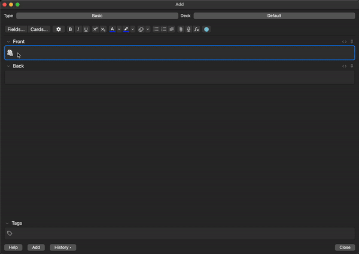

# AnkiVN – Better Web Browser

A lightweight, fully integrated web browser for Anki’s **Add Card** and **Browser** dialogs, designed to help you look up definitions, images, translations, and more without leaving Anki.



---

## Table of Contents

1. [Features](#features)  
2. [Installation](#installation)  
3. [Usage](#usage)  
   - [Opening/Closing the Browser Pane](#openingclosing-the-browser-pane)  
   - [Navigating & Searching](#navigating--searching)  
   - [Keyboard Shortcuts](#keyboard-shortcuts)  
4. [Configuration](#configuration)  
   - [Setting the Start URL](#setting-the-start-url)  
   - [Configuring Note Types & Fields](#configuring-note-types--fields)  
   - [Search Site Categories](#search-site-categories)  
5. [Development & Testing](#development--testing)  
6. [Requirements](#requirements)  
7. [License](#license)  

---

## Features

- **Embedded Browser Pane**  
  Browse any website directly inside Anki’s Add Card dialog or Browser sidebar—no need to switch to an external browser.

- **Multi-Tab Support**  
  Open multiple tabs within the same pane and switch between sites quickly.

- **URL Bar with Search Support**  
  Type a full URL or just enter search terms, and it will automatically redirect to Google Search (or your configured start URL).

- **Keyboard Shortcuts (Customizable)**  
  - `Ctrl+Shift+L` – Toggle (open/close) the browser pane.  
  - `Ctrl+T` – Open a new tab.  
  - `Ctrl+W` – Close the current tab.  
  - `Ctrl+L` – Focus the URL address bar.  

- **Automatic Search on Field Change**  
  When you select a different note (or its main field) in the Browser, the browser pane will automatically refresh and search using the new main field value.

- **Configurable Note Types & Fields**  
  • Select which note type(s) you want the browser to watch.  
  • Choose a “Main Field”—the field whose content will drive the automatic search.  
  • For every other field in the same note type, assign one or more “search site” categories (e.g., Dictionary, Thesaurus, Images, Vietnamese, etc.), so that when you click a field name in Add-Card, it opens all linked sites in new tabs.

- **Settings UI**  
  An easy-to-use Settings dialog inside Anki to:  
  1. Choose your default start URL (e.g., `https://www.google.com`).  
  2. Pick a note type from your collection.  
  3. Choose which note field is the “Main Field.”  
  4. For every additional field in that note type, check or uncheck the sites you want to search.

- **Auto Reset & Refresh**  
  • Auto-reset tab URLs when pressing the toggle shortcut, keeping only the tabs that match your current Main Field.  
  • If you close one of the configured tabs manually, the next time you press the toggle shortcut it will re-open that tab (based on the current Main Field content).

---

## Installation

1. **Download or Clone**  
   - Download the ZIP from this repository and unzip it, or  
   - Run `git clone https://github.com/YourUsername/AnkiVN---Better-Web-Browser.git` into your Anki Add-Ons folder.

2. **Place in Add-Ons Folder**  
   - Locate your Anki add-ons directory:  
     - On Windows:  
       ```
       %APPDATA%\Anki2\addons21\
       ```  
     - On macOS/Linux:  
       ```
       ~/Library/Application Support/Anki2/addons21/
       ```  
   - Copy the entire folder named `AnkiVN---Better-Web-Browser-main` (or rename it to something simpler, e.g. `better_web_browser`) into that `addons21` directory.

3. **Restart Anki**  
   After copying, fully close Anki and re-open it. The Better Web Browser should now be active.

---

## Usage

### Opening/Closing the Browser Pane

1. **In the “Add Card” dialog**:  
   - Click the **🌐 Web Browser** button in the toolbar,  
   - or press `Ctrl + Shift + L` on your keyboard.  
   The browser pane appears on the right side, docked inside the dialog.

2. **In the “Browser” (card listing)**:  
   - The pane automatically appears as you switch between notes (if configured).  
   - Toggle it on/off with the same `Ctrl + Shift + L` shortcut.

### Navigating & Searching

- **URL Bar**  
  - Click into the address bar at the top of the pane or press `Ctrl + L`.  
  - Type a full URL (e.g., `https://stackoverflow.com`) and press `Enter`.  
  - If you type plain text (no `http://` or `.com`), it will automatically perform a Google search (or your configured start-URL search).

- **Navigation Buttons**  
  - ◀︎ Back  
  - ▶︎ Forward  
  - ↻ Reload  

- **Tabs**  
  - Press `Ctrl + T` to open a blank new tab (defaulting to your start URL).  
  - Press `Ctrl + W` or click the “×” on the tab header to close it.  
  - Scroll or click between tab headers to switch tabs.

- **Automatic Field-Based Search**  
  - In the “Browser” window (note-listing), when you click on or highlight a note, the add-on checks the value of the configured **Main Field**.  
  - If that value differs from the previous selection, the browser pane will auto-load a search for that exact text (e.g., dictionary lookup for the word you’re studying).

- **Field-Specific Site Search (Add Card)**  
  - In the “Add Card” dialog, click any of your configured note fields (aside from the Main Field).  
  - The add-on will open one tab per “search site” you selected for that field (e.g., Cambridge Dictionary, Oxford Dictionary, Merriam-Webster, Google Images, etc.), each searching for the field’s text.

### Keyboard Shortcuts

| Shortcut                | Action                                                   |
|-------------------------|----------------------------------------------------------|
| `Ctrl + Shift + L`      | Toggle the browser pane (show/hide)                      |
| `Ctrl + T`              | Open a new tab (inside the pane)                         |
| `Ctrl + W`              | Close the current tab                                    |
| `Ctrl + L`              | Focus the URL address bar                                |
| `Alt + ←` / `Alt + →`   | Navigate backward/forward (same as browser buttons)      |
| `F5`                    | Reload current tab                                       |

> **Tip:** All shortcuts can be changed by editing `config.json` or via the “Settings → Better Web Browser” menu.

---

## Configuration

All configuration is done via **Anki → Tools → Add-Ons → Better Web Browser → Config**. Once you open the config window, you’ll see:

1. **Start URL**  
   Defines the homepage or default search engine. By default, this is set to `https://www.google.com`.  
   - If you type a keyword (no “http”), the browser will perform a search at this URL (e.g., Google).

2. **Note Type**  
   A dropdown listing all note types in your collection.  
   - Select the note type you primarily study with (e.g., “Vocabulary Template”, “Language Notes”).  
   - Once selected, the add-on scans its fields and populates the “Main Field” and “Field Search Settings.”

3. **Main Field**  
   The field whose content automatically triggers a browser search whenever you switch notes.  
   - Commonly used for a “Word” or “Term” field in vocabulary-type notes.

4. **Configurable Fields & Search Sites**  
   Below the “Main Field,” you’ll see a list of every other field in the chosen note type.  
   - Each field has a set of checkboxes grouped by **site categories** (e.g., Dictionary, Thesaurus, Images, Vietnamese, etc.).  
   - Check the boxes next to the sites you want opened whenever you click that field in Add-Card.  
   - Unchecked boxes mean no tabs will open for that site/category.

5. **Field Display States**  
   You can expand/collapse each field’s site checklist to reduce clutter. By default, all are collapsed.

6. **Save & Close**  
   - Once you finish configuring, click **Save** to write your settings to `meta.json`.  
   - Next time you open Add-Card or switch notes, the browser behavior follows your configuration.

---

## Development & Testing

- **Project Structure**

AnkiVN---Better-Web-Browser-main/
├── browser.py
├── config.py # Defines PREDEFINED_SEARCH_SITES, etc.
├── settings.py # Builds the Settings dialog UI
├── manifest.json # Anki add-on manifest
├── meta.json # Stores user configuration (note type, fields, sites)
├── config.json # Stores global settings (e.g., start_url)
├── demo.gif # Short GIF demo of functionality
├── tests/ # pytest test suite for config logic
│ ├── test_config.py
│ └── conftest.py
├── LICENSE
├── CHANGELOG.md
└── README.md

- **Running Tests**  
1. Install `pytest` (if you haven’t yet):  
   ```bash
   pip install pytest
   ```  
2. From the project root, run:  
   ```bash
   pytest
   ```  
3. All tests should pass. If you add new configuration options, be sure to add corresponding tests in `tests/test_config.py`.

- **Contributing**  
1. Fork the repository.  
2. Create a new branch (`git checkout -b feature/YourFeature`).  
3. Implement your changes and add tests where appropriate.  
4. Commit your changes (`git commit -m "feat: description of change"`).  
5. Open a Pull Request with a clear description of what you’ve done.

---

## Requirements

- **Anki ≥ 2.1.50 (Qt 6)**  
The add-on relies on `QWebEngineView`, which is only available in Anki distributions that bundle Qt 6.

- **Python 3.x**  
Anki ships with a Python interpreter, so no separate installation is required beyond what Anki provides.

---

## License

This project is licensed under the **GNU General Public License v3.0 or later (GPL v3+)**. See [LICENSE](LICENSE) for full details.
